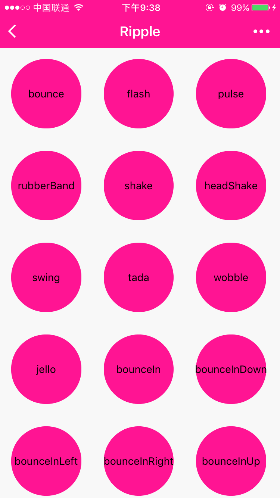

# Ripples.wxss

Ripples.wxss 是一个为微信小程序量身定制的 css3 动效库，引领微交互的潮流。大部分动效源自 [Animate.css](https://daneden.github.io/animate.css/)。

## 安装

 1. 如果你的微信小程序项目基于 nodejs 开发，你可以使用 npm 安装，并拷贝到相关目录后 `@import`

```nodejs
npm install ripples.wxss --save
```

 2. 或者直接 `clone` 或 `download` 仓库[https://github.com/jeasonstudio/Ripples.wxss.git](https://github.com/jeasonstudio/Ripples.wxss.git)，拷贝 `ripples.wxss` 或 `ripples.min.wxss`到相关目录后 `@import`

## 使用

 1. 首先在你想引入 Ripples.wxss 动效的 `element` 上加 `ripple` class。

 2. 如果你想让他循环不断播放，请添加 `infinite` class。

 3. 接下来你需要再添加如下你需要的 class：

  * `bounce`
  * `flash`
  * `pulse`
  * `rubberBand`
  * `shake`
  * `headShake`
  * `swing`
  * `tada`
  * `wobble`
  * `jello`
  * `bounceIn`
  * `bounceInDown`
  * `bounceInLeft`
  * `bounceInRight`
  * `bounceInUp`
  * `bounceOut`
  * `bounceOutDown`
  * `bounceOutLeft`
  * `bounceOutRight`
  * `bounceOutUp`
  * `fadeIn`
  * `fadeInDown`
  * `fadeInDownBig`
  * `fadeInLeft`
  * `fadeInLeftBig`
  * `fadeInRight`
  * `fadeInRightBig`
  * `fadeInUp`
  * `fadeInUpBig`
  * `fadeOut`
  * `fadeOutDown`
  * `fadeOutDownBig`
  * `fadeOutLeft`
  * `fadeOutLeftBig`
  * `fadeOutRight`
  * `fadeOutRightBig`
  * `fadeOutUp`
  * `fadeOutUpBig`
  * `flipInX`
  * `flipInY`
  * `flipOutX`
  * `flipOutY`
  * `lightSpeedIn`
  * `lightSpeedOut`
  * `rotateIn`
  * `rotateInDownLeft`
  * `rotateInDownRight`
  * `rotateInUpLeft`
  * `rotateInUpRight`
  * `rotateOut`
  * `rotateOutDownLeft`
  * `rotateOutDownRight`
  * `rotateOutUpLeft`
  * `rotateOutUpRight`
  * `hinge`
  * `rollIn`
  * `rollOut`
  * `zoomIn`
  * `zoomInDown`
  * `zoomInLeft`
  * `zoomInRight`
  * `zoomInUp`
  * `zoomOut`
  * `zoomOutDown`
  * `zoomOutLeft`
  * `zoomOutRight`
  * `zoomOutUp`
  * `slideInDown`
  * `slideInLeft`
  * `slideInRight`
  * `slideInUp`
  * `slideOutDown`
  * `slideOutLeft`
  * `slideOutRight`
  * `slideOutUp`

> 具体样式可以参考 [Animate.css](https://daneden.github.io/animate.css/)。

## 使用实例

 - 你可以查看根目录下的 DEMO 项目，为所有 Ripples.wxss 的综合展示：

 

 - 也可以参考如下的例子：

 ```javascript
 //imdex.js
 Page({
	data: {
        bounceShow: false
	},
	showBounce: function () {
		let that = this
        that.setData({
            bounceShow: true
        })
        setTimeout(function() {
            that.setData({
                bounceShow: false
            }, 2000)
        })
 }}
 ```

 ```css
 /* imdex.wxss */
 @import "ripples.wxss";
 ```

 ```html
 <!--index.wxml-->
<view class="ripple {{bounceShow ? bounce:''}}">bounce</view>
 ```

  - 不同场景下的使用逻辑还请自行斟酌。

## 个性化引入

Ripple.wxss 使用 [gulp.js](http://gulpjs.com/) 进行 wxss 的格式化和压缩，所以你也可以用它来个性化生成 `Ripples.min.wxss` 后引入，以避免代码冗余。

 1. 你需要安装 `gulp` 和其他依赖

```sh
$ cd path/to/Ripples.wxss/
$ sudo npm install
```

 2. 你可以执行 `gulp` 命令，来生成 `ripples.wxss` `ripples.min.wxss` 文件，具体包含请参见并修改根目录下的 `ripples-config.json` 文件。

```javascript
"attention_seekers": {
  "bounce": true,
  "flash": false,
  "pulse": false,
  "shake": true,
  "headShake": true,
  "swing": true,
  "tada": true,
  "wobble": true,
  "jello":true
}
```

## 开源协议

 - [MIT](LICENSE)